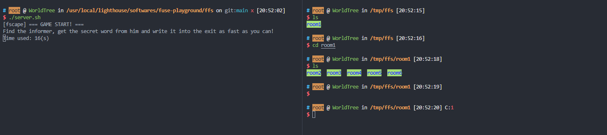
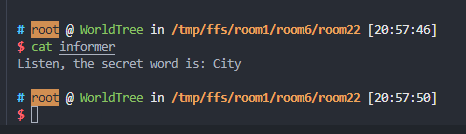
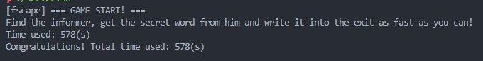

# fscape 

A **F**ile **S**ystem E**scape** Game. Use `cd` to move, find `exit ` in the fs!

Fscape is a DIY homework for my OS course. It contains two parts:

- Game part ( `game/` ). A map generator, a game server and some scripts to run the game.
- File system part. The file system (**ffs**, Fake File System) is totally separated from the game part.


## How to play

### Start

To have a good experience, I strongly suggest using two shells (a server shell and a player shell)

First, run in the server shell 

```
./preprocess.sh
```

to mount the fs. 

Then in the player shell run

```
source player.sh
```

It will bring you to the root of ffs. (default, `/tmp/ffs`)

Finally, it is time to start the server. In the server shell, run

```
./server.sh
```

Then your shell will be like (left: server shell, right: player shell)



### Play

The goal of this game is to "escape from the file system `/tmp/ffs`" as fast as you can.

YOU CAN ONLY USE THE FOLLOWING COMMANDS

```
cd: move in the fs
ls: check in current room.
cat: chat with others.
echo: write secret words to exit.
```

The player will be put into a file system with many **rooms** (they are all directories).

To escape, you should find two key files:

- **informer**: this guy will tell you a secret word.
- **exit**: the exit.

When you find the informer, cat it.



As we can see, the secret word in this round is "City".

When you find the exit, write the secret word into it.


(Notice: you should write the word carefully because I use `strcmp` to check the answer.)

And the game ends with your time used.



PS: You will also find some **NPC**s. You can cat them to chat with them. It is just for fun.

### Clean

After each round, run

```
make clean
```

To remove the disk image and umount the ffs.

## ffs

**F**ake **F**ile **S**ystem is a toy FUSE-based user-space file system. 

It use libfuse version 30 (see `include/define.h`) so some APIs may be different with new versions.

 ### Implemented API

```
getattr
read
readdir
mkdir
rmdir
mknod
unlink
write
rename
statfs
```

You can do almost all basic fs operations on ffs.

```
cd
ls
rm 
mkdir/rmdir
cat
echo
touch
stat

open/read/write/mmap (in C)
```

Some operations are declared but not implemented. (e.g. File Permissions Management)

```
chmod
chown
truncate
open
```

### Design

The total content is stored in a file named `disk_image`. It contains three parts: super_block, index, bank.


- super_block stores information about the file system like some bitmaps, block number, inode number.
- `inodes` are stored in index part.
- `blocks` are stored in bank part.

##### Block Located Strategy

One file may contain several blocks. 

Because ffs is just a toy fs (which is not designed to store many files initially), I do not use some complicated methods to search blocks from inodes: ffs inode directly **stores addresses of all blocks ** (Compared to Linux Ext4, which stores addresses of first 12 blocks and use single-indirect, double indirect, triple indirect...).

##### Read-write Strategy

ffs does not have cache. So each time it just reads/writes files from/to disk.

Specially, super_block is read from disk_image and resident in memory.

If ffs is umounted normally, all data will be written back to `disk_image` file.